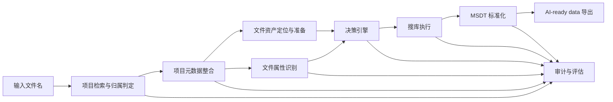
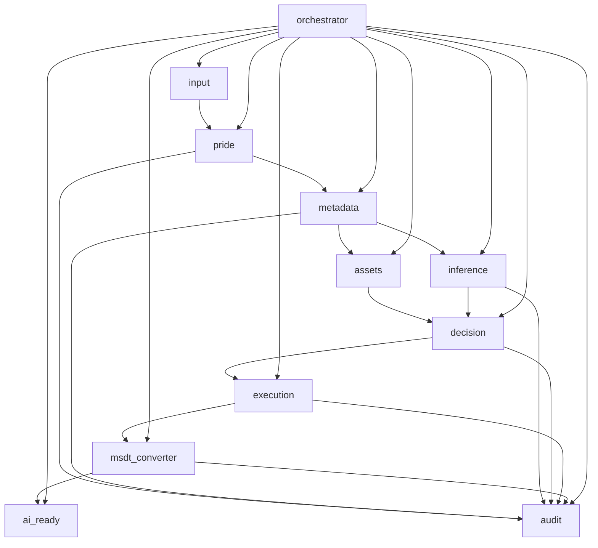
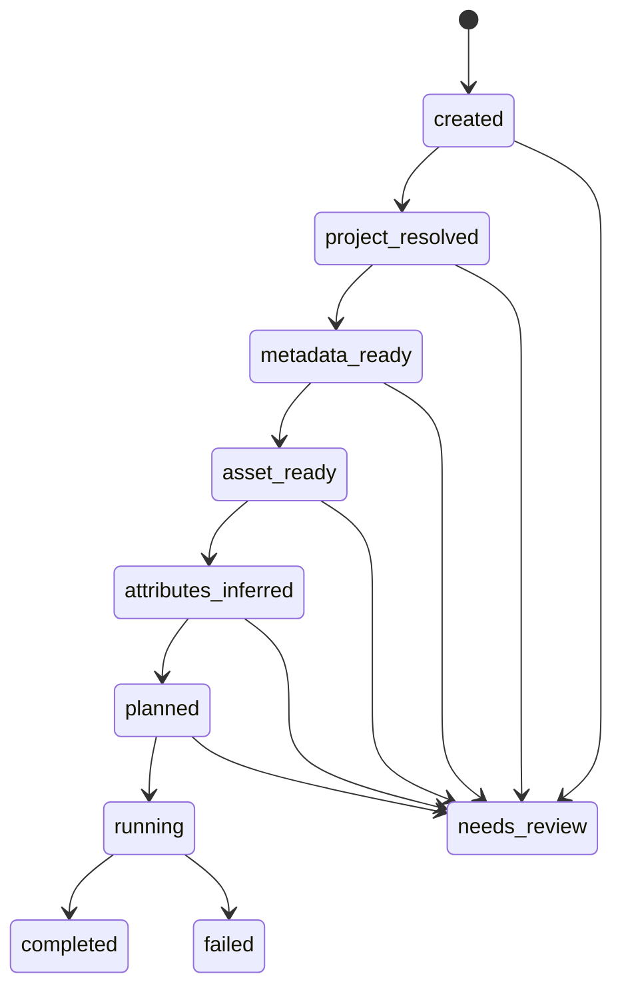

# PRIDE AI-ready Data Agent 模块设计

本文档基于项目需求文档《蛋白质组学AI-ready data Agent项目》整理，目标是把“单文件名输入 -> PRIDE 追溯 -> 属性识别 -> workflow 决策 -> MSDT -> AI-ready data”落成可实施的工程架构。

## 1. 设计目标

系统需要满足以下约束：

- 用户输入只有文件名，例如 `WT_5_Lys-c.raw`
- 系统自行到 PRIDE 检索候选项目，并按“最早 project 优先”规则选主项目
- 若存在 SDRF，则优先使用 SDRF 识别文件属性
- 若不存在 SDRF，则基于 PRIDE 页面描述、协议、结构化字段和文件命名规则回退推断
- 系统自行定位真实数据载体、准备执行环境并完成 workflow 调度
- `MSDT` 输出格式严格对齐 `guomics-lab/MSDT-Converter`
- `AI-ready data` 是在 MSDT 基础上的派生层，而不是另一套独立 schema

从工程实现角度，系统应同时具备：

- 可审计：每个结论都要有证据、来源、置信度
- 可回退：关键属性不确定时不能盲目执行
- 可扩展：首版先严格闭环 DDA，DIA 预留扩展位
- 可测试：模块间靠结构化对象交互，而不是裸字典和临时文件路径

## 2. 总体架构

建议将系统划分为三层：

1. 编排层
   负责串联流程、管理任务状态、异常回退与重试。
2. 领域能力层
   负责 PRIDE 检索、元数据整合、属性识别、决策、执行。
3. 结果治理层
   负责 MSDT 标准化、AI-ready 导出、审计与评估。

主链建议固定为：

`输入文件名 -> 项目解析 -> 项目元数据整合 -> 文件资产定位/下载 -> 属性识别 -> 决策引擎 -> 搜库执行 -> MSDT 生成 -> AI-ready 导出 -> 审计落盘`



## 3. 核心模块设计

### 3.1 输入与任务模块

职责：

- 接收用户输入
- 标准化文件名
- 生成任务 ID
- 初始化任务状态

输入：

- `input_file_name: str`

输出对象：

- `InputTask`

推荐字段：

| 字段 | 类型 | 说明 |
|---|---|---|
| `task_id` | `str` | 全局唯一任务标识 |
| `original_input` | `str` | 用户原始输入 |
| `source_type` | `Literal["file_name"]` | 当前场景固定为文件名输入 |
| `file_name` | `str` | 原始文件名 |
| `normalized_name` | `str` | 归一化文件名，用于匹配 |
| `stem` | `str` | 去扩展名文件名 |
| `extension` | `str` | 文件扩展名 |

说明：

- 本模块不做生物信息学判断
- 只负责把异构输入统一成后续模块可以消费的任务对象

### 3.2 项目检索与归属判定模块

职责：

- 围绕文件名到 PRIDE 检索候选项目
- 对候选项目打分
- 冲突消解并选出主项目

输入：

- `InputTask`

输出对象：

- `ProjectCandidate[]`
- `ProjectResolution`

推荐检索策略：

- 文件名精确匹配
- 去扩展名匹配
- 文件名前缀匹配
- 项目文件列表扫描
- 同步保留命中证据

推荐字段：

| 字段 | 类型 | 说明 |
|---|---|---|
| `project_accession` | `str` | PRIDE project accession |
| `matched_file` | `str` | 命中的项目内文件名 |
| `match_type` | `str` | exact / stem / prefix / fuzzy |
| `match_score` | `int` | 匹配分数 |
| `publication_date` | `date \| None` | 发布时间 |
| `submission_date` | `date \| None` | 提交时间 |
| `evidence` | `list[str]` | 命中依据 |
| `metadata_consistency` | `float` | 元数据完整度/一致性 |

主项目判定规则建议：

1. 先比 `match_score`
2. 再比 `metadata_consistency`
3. 最后按最早 `publication_date`，若缺失则按最早 `submission_date`

### 3.3 项目元数据整合模块

职责：

- 拉取 project 级上下文
- 合并 PRIDE 结构化字段、文件列表、SDRF、协议文本等
- 输出统一的 `ProjectContext`

输入：

- `ProjectResolution.primary_project`

输出对象：

- `ProjectContext`

建议拆成两个子模块：

1. 结构化元数据子模块
   - 读取 PRIDE API 字段
   - 解析文件列表
   - 识别和下载 SDRF
2. 非结构化元数据子模块
   - 解析 `projectDescription`
   - 解析 `sampleProcessingProtocol`
   - 解析 `dataProcessingProtocol`
   - 保留文献或说明文本摘录

推荐字段：

| 字段 | 类型 | 说明 |
|---|---|---|
| `project_accession` | `str` | 主项目 accession |
| `file_name` | `str` | 当前待处理文件名 |
| `metadata` | `dict[str, MetadataValue]` | 统一元数据字典 |
| `sdrf_rows` | `list[dict[str, Any]]` | 与目标文件相关的 SDRF 行 |
| `project_files` | `list[dict[str, Any]]` | 项目文件列表 |

其中 `MetadataValue` 建议包含：

| 字段 | 类型 | 说明 |
|---|---|---|
| `value` | `Any` | 原始值 |
| `source` | `str` | 来源路径，如 `pride.projectDescription` |
| `source_level` | `str` | project / sdrf / file / derived |
| `completeness` | `float` | 完整度评分 |

### 3.4 文件资产定位与数据准备模块

这是工程实现里必须显式增加的模块，原始文档没有单独列出，但它决定了系统是否真的能“从文件名跑到 MSDT”。

职责：

- 在主项目中找到与输入文件对应的真实执行资产
- 优先选择可直接用于执行的载体
- 完成下载与必要的格式准备

输入：

- `InputTask`
- `ProjectContext`

输出对象：

- `FileAsset`

推荐策略：

1. 优先找匹配的 `.mzML`
2. 其次找 Bruker `.d`
3. 再找厂商原始格式，如 `.raw`
4. 若只有 `.raw`，进入 `raw -> mzML` 转换子流程

推荐字段：

| 字段 | 类型 | 说明 |
|---|---|---|
| `original_file_name` | `str` | 用户输入文件名 |
| `resolved_asset_type` | `Literal["mzml", "tims", "raw", "unknown"]` | 最终资产类型 |
| `matched_project_file` | `str \| None` | 项目内实际命中文件 |
| `download_url` | `str \| None` | 下载链接 |
| `local_path` | `Path \| None` | 下载后本地路径 |
| `prepared_path` | `Path \| None` | 转换/预处理后的路径 |
| `requires_conversion` | `bool` | 是否需要转换 |
| `asset_confidence` | `float` | 定位置信度 |

说明：

- 用户不需要准备 `.mzML` 或 `.d`
- 但系统内部必须得到可执行的数据文件，才能完成真实 DDA -> MSDT 闭环

### 3.5 文件属性识别模块

职责：

- 从项目级证据和文件级线索中识别实验属性
- 为决策引擎提供结构化输入

输入：

- `ProjectContext`
- `FileAsset`
- `InputTask`

输出对象：

- `AttributeSet`

首版建议至少识别：

- `acquisition_mode`
- `species`
- `instrument_name`
- `instrument_family`
- `enzyme`
- `labeling_strategy`
- `fixed_mods`
- `variable_mods`
- `fractionation_hint`
- `search_parameter_hints`

识别优先级：

1. SDRF
2. PRIDE 结构化字段
3. 文本协议和描述
4. 文件名规则

每个属性都应输出为 `AttributeValue`：

| 字段 | 类型 | 说明 |
|---|---|---|
| `value` | `Any` | 属性值 |
| `confidence` | `float` | 置信度 |
| `source` | `str` | 来源 |
| `evidence_excerpt` | `str` | 证据摘录 |
| `conflict_flag` | `bool` | 是否冲突 |

规则要求：

- DIA 识别必须使用单词边界正则，避免把 `diameter` 误判为 DIA
- 文件名规则要能利用 `WT_5_Lys-c.raw` 这类线索识别 `Lys-C`
- 关键属性不确定时进入 `needs_review`

### 3.6 决策引擎模块

职责：

- 将 `AttributeSet` 和 `FileAsset` 转化为可执行计划
- 严格面向 `MSDT-Converter` 生成执行配置

输入：

- `AttributeSet`
- `FileAsset`
- `ProjectContext`

输出对象：

- `ExecutionPlan`

决策内容包括：

- FASTA 选择
- workflow 选择
- 参数模板选择
- 资源分配
- converter config 生成

推荐流程：

1. 按 `DDA/DIA` 一级分流
2. 按 `label-free / TMT / iTRAQ / SILAC` 二级细分
3. 按仪器平台、酶切方式和 PTM 线索微调
4. 生成严格面向执行器和 `MSDT-Converter` 的计划

推荐字段：

| 字段 | 类型 | 说明 |
|---|---|---|
| `raw_data_type` | `Literal["mzml", "tims"]` | 执行数据类型 |
| `fasta_path` | `Path` | FASTA 路径 |
| `fasta_selection_mode` | `Literal["reproduced", "inferred", "defaulted"]` | FASTA 选择模式 |
| `fragpipe_workflow_path` | `Path` | workflow 模板路径 |
| `manifest_path` | `Path` | FragPipe manifest 路径 |
| `converter_config_path` | `Path` | `MSDT-Converter` config 路径 |
| `expected_pin_glob` | `str` | 期望的 `_edited.pin` 路径/模式 |
| `output_paths` | `dict[str, Path]` | 输出目录 |
| `needs_review` | `bool` | 是否需人工复核 |
| `blocking_issues` | `list[str]` | 阻塞原因 |

说明：

- 决策引擎的重点是“为什么选这个计划”
- 每次决策都要可追溯

### 3.7 搜库执行模块

职责：

- 执行数据准备、workflow 调用和运行状态监控
- 保存中间产物和日志

输入：

- `ExecutionPlan`

输出：

- `RunResult`
- 中间文件目录

建议拆为两个执行器：

1. 资产准备执行器
   - 下载 project 文件
   - 原始格式转换
   - materialize manifest
   - materialize workflow 副本
2. workflow 执行器
   - 调用 FragPipe
   - 监控运行状态
   - 检测 `_edited.pin`
   - 触发 `MSDT-Converter`

执行层必须支持：

- 原始文件准备
- workflow 启动
- 运行状态跟踪
- 错误诊断
- 一次受控重试
- 全量日志归档

### 3.8 MSDT 标准化与 AI-ready 导出模块

职责：

- 严格使用 `MSDT-Converter` 生成 MSDT
- 从 MSDT 派生 AI-ready data

输入：

- `ExecutionPlan`
- workflow 输出
- `MSDT-Converter` 输出

输出：

- `MSDT parquet`
- `AI-ready parquet / tables`

设计原则：

- `MSDT` 格式以 `MSDT-Converter` 为准
- 本系统不重新定义新的主 schema
- AI-ready 仅做 provenance 增强和再分析友好导出

建议增强字段：

- `project_accession`
- `source_file`
- `attribute_evidence_json`
- `decision_trace_json`
- `run_manifest_json`

### 3.9 审计与评估模块

职责：

- 记录全流程证据与版本信息
- 生成复核队列
- 支持方法学评估和批量统计

输入：

- 全流程中间对象和产物

输出：

- `run_manifest.json`
- `decision_trace.json`
- `review_queue.json`
- 汇总统计结果

至少记录：

- 项目匹配依据
- 属性识别来源与置信度
- FASTA/workflow 选择逻辑
- 外部工具版本
- 错误原因与重试记录
- 待人工复核条目

## 4. 核心数据对象

建议模块间只传以下对象，而不是裸 `dict`：

- `InputTask`
- `ProjectCandidate`
- `ProjectResolution`
- `ProjectContext`
- `FileAsset`
- `AttributeSet`
- `ExecutionPlan`
- `RunManifest`

其中推荐新增但当前代码尚未完整落地的关键对象是：

- `FileAsset`
- `RunResult`
- `ReviewItem`

## 5. 推荐目录结构

```text
src/agent/
  input/            # 输入标准化
  pride/            # PRIDE API 与项目解析
  metadata/         # 项目元数据整合与 SDRF 解析
  assets/           # 文件资产定位、下载、转换
  inference/        # 文件属性识别
  decision/         # FASTA/workflow/参数决策
  execution/        # 执行器、manifest、workflow 调度
  msdt_converter/   # Converter 配置与调用
  ai_ready/         # AI-ready data 导出
  audit/            # 审计、评估、复核队列
  orchestrator/     # 编排与状态机
  models.py         # 核心数据对象
```

当前代码已经具备的目录：

- `input`
- `pride`
- `metadata`
- `inference`
- `decision`
- `execution`
- `msdt_converter`
- `ai_ready`
- `orchestrator`

建议后续新增：

- `assets`
- `audit`

## 6. 模块依赖关系

建议保持以下依赖方向，避免循环依赖：



设计约束：

- 低层模块不依赖编排层
- `execution` 不应反向依赖 `inference`
- `ai_ready` 不应改写 `MSDT-Converter` 输出逻辑
- `audit` 只消费事件和对象，不回写业务决策

## 7. 状态机建议

建议定义统一任务状态：

- `created`
- `project_resolved`
- `metadata_ready`
- `asset_ready`
- `attributes_inferred`
- `planned`
- `running`
- `completed`
- `needs_review`
- `failed`

状态转换建议：



触发 `needs_review` 的典型条件：

- 找不到唯一主项目
- 找到多个项目且证据冲突
- 无法定位真实执行资产
- DDA / DIA 无法可靠区分
- 物种、仪器、酶切等关键属性缺失
- 找不到匹配的已验证 workflow 模板

## 8. 里程碑落地建议

结合需求文档中的三阶段目标，建议按以下顺序开发：

### 里程碑 1：最小闭环

目标：

- 文件名输入
- PRIDE 项目解析
- SDRF 优先元数据整合
- 属性识别
- DDA 决策
- 任务目录物化

### 里程碑 2：真实执行闭环

目标：

- 文件资产定位与下载
- `.raw -> mzML` 自动转换
- FragPipe 执行
- MSDT-Converter 调用
- AI-ready data 输出

### 里程碑 3：增强与规模化

目标：

- DIA 适配层
- 批量任务调度
- 评估与审计仪表化
- review queue 与人工复核闭环

## 9. 当前代码与目标架构的差距

当前仓库已经实现的能力包括：

- 文件名标准化
- PRIDE 项目检索与主项目判定
- SDRF 解析与项目元数据整合
- 规则驱动属性识别
- DDA execution plan 生成
- `MSDT-Converter` config 生成与 bundle 物化
- 运行环境检查与 converter bootstrap

当前仍建议尽快补齐的部分：

1. `assets` 模块  
   目前还缺“文件名 -> PRIDE 真正数据文件 -> 下载/转换”的完整链路。

2. `audit` 模块  
   当前审计落盘散在 orchestrator 中，建议独立成模块，统一事件与指标记录。

3. `RunResult` / review queue  
   当前执行结果结构还不够清晰，不利于后续批量任务和异常复核。

## 10. 结论

需求文档中的 8 个模块方向是合理的，但从工程实现上看，建议显式补出两个核心模块：

- `文件资产定位与数据准备模块`
- `编排/状态机模块`

这样系统才能真正满足：

- 输入只有文件名
- 自动到 PRIDE 找项目
- 自动定位真实数据文件
- 自动跑到 MSDT
- 输出可追溯、可复核的 AI-ready data
